# Memory Bank Guidelines

## Overview
This document defines the standardized approach for creating and maintaining memory bank entries across all agents and projects.

## Schema Compliance
All memory entries MUST conform to the schema defined in `schema.json`. Every entry requires:

### Required Fields
- **id**: Unique identifier in kebab-case (e.g., `docker-setup-decision`)
- **title**: Human-readable title (1-100 characters)
- **type**: One of the defined memory types
- **tags**: Array of lowercase, kebab-case tags (minimum 1)
- **updated_at**: ISO 8601 timestamp

### Optional Fields
- **status**: `active` (default), `archived`, or `draft`
- **priority**: `low`, `medium`, `high`, or `critical`
- **related**: Array of related memory entry IDs

## Memory Types

### 1. Context (`context`)
**Purpose**: Current state and active work tracking
**When to use**: Document current project status, immediate goals, blockers
**Update frequency**: Daily/Weekly during active development

### 2. Decision (`decision`)
**Purpose**: Important choices made and their rationale
**When to use**: Significant technical or business decisions
**Update frequency**: When decisions are made or reviewed

### 3. Progress (`progress`)
**Purpose**: Track completed work and milestones
**When to use**: Regular progress updates and milestone tracking
**Update frequency**: Weekly/Sprint cycles

### 4. Brief (`brief`)
**Purpose**: Project overview and objectives
**When to use**: Project initiation or major scope changes
**Update frequency**: Infrequently, major revisions only

### 5. Pattern (`pattern`)
**Purpose**: Reusable solutions and design patterns
**When to use**: Document repeatable solutions to common problems
**Update frequency**: When patterns evolve or new ones emerge

### 6. Architect (`architect`)
**Purpose**: System architecture and design decisions
**When to use**: Document system structure and architectural choices
**Update frequency**: When architecture changes

### 7. Troubleshoot (`troubleshoot`)
**Purpose**: Problem-solving documentation
**When to use**: Document issues encountered and their solutions
**Update frequency**: When problems are resolved

### 8. Reference (`reference`)
**Purpose**: Quick reference information and documentation
**When to use**: Command references, API docs, configuration guides
**Update frequency**: When referenced information changes

## Naming Conventions

### File Names
- Use kebab-case: `docker-setup-decision.md`
- Include type prefix when helpful: `arch-microservices.md`
- Keep concise but descriptive

### IDs
- Must match filename without extension
- Kebab-case only: `docker-setup-decision`
- Unique across entire memory bank

### Tags
- Lowercase, kebab-case: `docker`, `postgres`, `security`
- Use consistent vocabulary across entries
- Include technology stack tags: `docker`, `sonarqube`, `postgres`
- Include category tags: `infrastructure`, `security`, `development`

## Content Structure

### Front Matter
Always use YAML front matter with required fields:
```yaml
---
id: unique-identifier
title: Human Readable Title
type: context
tags: ["tag1", "tag2", "tag3"]
updated_at: "2024-01-01T12:00:00Z"
status: active
---
```

### Content Organization
1. Start with a clear H1 title that matches the front matter title
2. Use consistent heading hierarchy (H2 for major sections)
3. Include relevant code examples in appropriate language blocks
4. Use Mermaid diagrams for visual representations (see Diagram Standards below)
5. Link to related memories using relative paths
6. Keep content focused and atomic (one logical concept per file)

## Diagram Standards

### Mermaid Chart Usage
All visual diagrams should use Mermaid syntax for consistency and rendering compatibility:

#### Architecture Diagrams


#### Process Flows


#### Progress Tracking

```mermaid
flowchart TD
    A[Phase 1] --> B[Task 1 ✓]
    A --> C[Task 2 🔄]
    D[Phase 2] --> E[Task 3 📋]
    C --> D

    style B fill:#90EE90
    style C fill:#FFE4B5
    style E fill:#F0F8FF
```


#### Entity Relationships


### Diagram Guidelines
- **Consistency**: Use standard Mermaid syntax across all entries
- **Clarity**: Keep diagrams focused and easy to understand
- **Labeling**: Use descriptive labels for all components
- **Grouping**: Use subgraphs to show system boundaries
- **Direction**: Use consistent flow directions (TB for hierarchies, LR for processes)
- **Colors**: Avoid custom colors unless critical for understanding

## Maintenance Guidelines

### Regular Tasks
- **Weekly**: Update `updated_at` timestamps for modified entries
- **Monthly**: Review and archive outdated entries
- **Quarterly**: Validate schema compliance across all entries

### Status Management
- **active**: Current and relevant information
- **draft**: Work in progress, not yet finalized
- **archived**: Historical information, no longer current

### Cross-References
- Use relative links: `[Related Decision](./decision-log.md)`
- Update related entries when creating new ones
- Maintain bidirectional relationships where relevant

## Agent Collaboration

### Creating New Entries
1. Check existing entries to avoid duplication
2. Use appropriate templates from `templates/` directory
3. Follow naming conventions consistently
4. Include all required front matter fields
5. Add relevant cross-references

### Updating Entries
1. Always update `updated_at` timestamp
2. Consider impact on related entries
3. Maintain backward compatibility in cross-references
4. Archive rather than delete outdated information

### Conflict Resolution
- Use schema validation to catch formatting issues
- Maintain consistent tagging vocabulary
- Follow the "one concept per file" principle
- Prefer specific over general when choosing memory types

## Quality Standards

### Content Quality
- Write clear, concise descriptions
- Include sufficient context for understanding
- Use examples where helpful
- Maintain professional tone

### Technical Accuracy
- Verify technical details before documenting
- Include version information where relevant
- Test command examples and code snippets
- Link to authoritative sources

### Consistency
- Use consistent terminology across entries
- Follow template structures
- Maintain uniform formatting
- Apply tagging standards consistently

## Templates Usage

### Available Templates
All memory types have corresponding templates in `templates/` directory:
- `context.md` - For current state documentation
- `decision.md` - For decision logging
- `progress.md` - For progress tracking
- `brief.md` - For project briefs
- `pattern.md` - For design patterns
- `architect.md` - For architecture documentation
- `troubleshoot.md` - For problem-solving
- `reference.md` - For reference documentation

### Using Templates
1. Copy appropriate template from `templates/` directory
2. Rename file following naming conventions
3. Update all placeholder content
4. Modify front matter with correct values
5. Remove unused sections from template

## Validation

### Schema Validation
Entries can be validated against `schema.json` using standard JSON Schema validators. Key validation points:
- Required fields presence
- ID format (kebab-case)
- Tag format (lowercase, kebab-case)
- Timestamp format (ISO 8601)
- Type enumeration compliance

### Content Review
- Ensure content matches declared type
- Verify cross-references are valid
- Check for duplicate information
- Confirm appropriate tagging

## Migration
When updating existing memory banks to this specification:
1. Back up existing content
2. Update schema.json to new version
3. Migrate existing entries to new format
4. Add missing required fields
5. Validate all entries against new schema
6. Update cross-references to new file structure