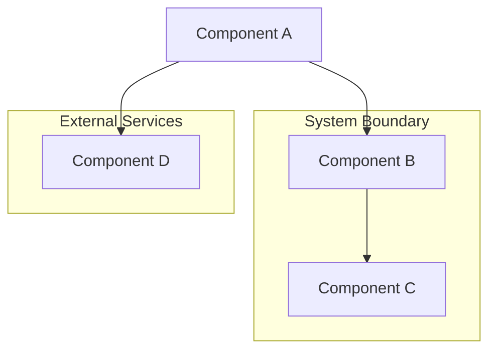
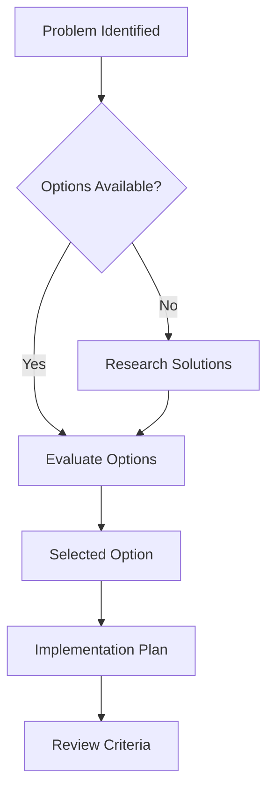
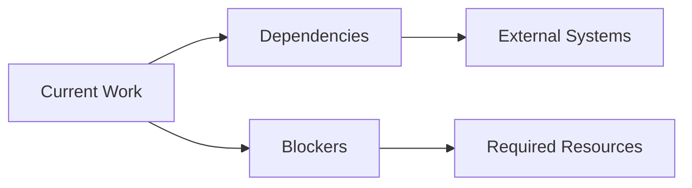
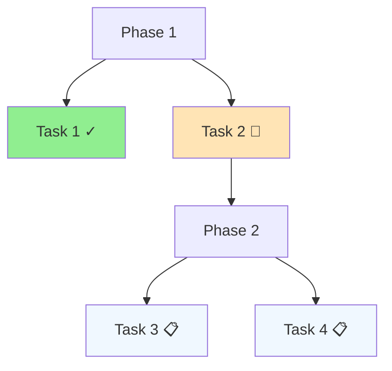
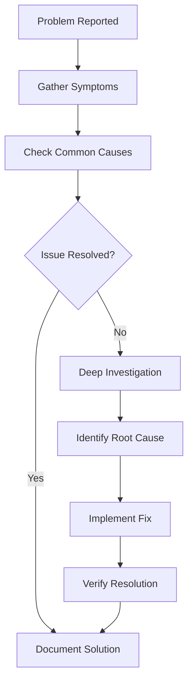

# Mermaid Test File

Test each diagram type to verify syntax:

## 1. Architecture (Graph)

```mermaid
graph TB
    A[Component A] --> B[Component B]
    B --> C[Component C]
    A --> D[Component D]

    subgraph System["System Boundary"]
        B
        C
    end

    subgraph External["External Services"]
        D
    end
```

## 2. Decision Flow

```mermaid
flowchart TD
    A[Problem Identified] --> B{Options Available?}
    B -->|Yes| C[Evaluate Options]
    B -->|No| D[Research Solutions]
    C --> E[Selected Option]
    D --> C
    E --> F[Implementation Plan]
    F --> G[Review Criteria]
```

## 3. Context Flow

```mermaid
graph LR
    A[Current Work] --> B[Dependencies]
    A --> C[Blockers]
    B --> D[External Systems]
    C --> E[Required Resources]
```

## 4. Progress Flow

```mermaid
flowchart TD
    A[Phase 1] --> B[Task 1 ✓]
    A --> C[Task 2 🔄]
    D[Phase 2] --> E[Task 3 📋]
    D --> F[Task 4 📋]
    C --> D

    style B fill:#90EE90
    style C fill:#FFE4B5
    style E fill:#F0F8FF
    style F fill:#F0F8FF
```

## 5. Troubleshooting Flow

```mermaid
flowchart TD
    A[Problem Reported] --> B[Gather Symptoms]
    B --> C[Check Common Causes]
    C --> D{Issue Resolved?}
    D -->|Yes| E[Document Solution]
    D -->|No| F[Deep Investigation]
    F --> G[Identify Root Cause]
    G --> H[Implement Fix]
    H --> I[Verify Resolution]
    I --> E
```