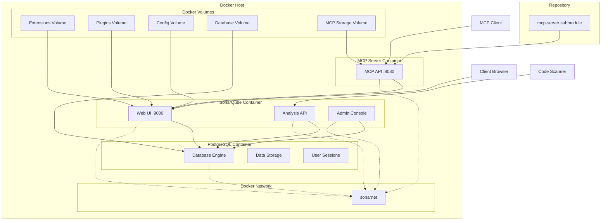

# SonarQube Server Architecture

## Overview

This document outlines the architectural design and key decisions for the SonarQube Open Server project - a Docker Compose setup for running SonarQube locally with PostgreSQL database.

## Architectural Principles

### 1. Container-First Design

- **Decision**: Use Docker Compose for deployment and orchestration
- **Rationale**: Provides isolation, portability, and ease of deployment across different environments
- **Impact**: Reduces setup complexity from manual installations to single-command deployment

### 2. Database Separation

- **Decision**: Use PostgreSQL as external database (not embedded H2)
- **Rationale**: Production-ready persistence, better performance for concurrent users, easier backup strategies
- **Impact**: Supports multiple users and maintains data integrity across container restarts

### 3. Persistent Data Management

- **Decision**: Implement Docker volumes for critical data storage
- **Rationale**: Ensures data survives container recreation/recycling
- **Impact**: Protects expensive operations like initial database setup and analysis results

### 4. Environment-Specific Configuration

- **Decision**: Use .env files and override files for different environments
- **Rationale**: Allows same base configuration to work in development, staging, and production
- **Impact**: Supports development workflows and production hardening without code changes

### 5. Security-First Approach

- **Decision**: Implement ulimits, network isolation, and credential management
- **Rationale**: Follows Docker and SonarQube security best practices
- **Impact**: Protects from common container attacks and unauthorized access

### 6. Source Code Integration for Experimental Features

- **Decision**: Include the `sonarqube-mcp-server` as a submodule and build it from source.
- **Rationale**: This repository is a development log and project space for creating, configuring, and deploying the SonarQube server. Including the `sonarqube-mcp-server` as a submodule allows for greater control over the experimental feature, and it allows developers to make changes to it if they need to.
- **Impact**: The `sonarqube-mcp-server` is built from source as part of the Docker Compose setup. This increases the build time, but it provides greater flexibility and control.

## System Architecture

### Data Flow

1. **Container Startup**: Docker Compose initializes both SonarQube and PostgreSQL
2. **Database Connection**: SonarQube connects to PostgreSQL using JDBC
3. **Volume Mounts**: Persistent volumes mount for data preservation
4. **Service Discovery**: Internal Docker networking handles inter-container communication
5. **Environment Configuration**: .env and properties files configure behavior

## Design Patterns Applied

### 1. Configuration as Code

- Externalized all configuration to files (.env, docker-compose.yml, sonar.properties)
- Environment-specific overrides via docker-compose.override.yml
- No hardcoded values in container images

### 2. Infrastructure as Code

- Entire infrastructure defined as Docker Compose files
- Declarative approach to service definitions
- Easy to version control and replicate

### 3. Separation of Concerns

- Database separate from application
- Configuration separate from code
- Development vs. production configurations separated

### 4. Fail-Fast Design

- Container health checks and dependency management
- Proper error handling and logging configuration
- Resource limits to prevent system impact

## Performance Considerations

### Resource Allocation

- **SonarQube**: Configurable JVM memory (1-4GB typical)
- **PostgreSQL**: Dedicated CPU and memory allocation
- **File Descriptors**: Increased ulimits for concurrent users

### Optimization Strategies

- **Volume Performance**: Local Docker volumes for speed
- **Memory Tuning**: JVM garbage collection optimization
- **Database Indexing**: Leverages PostgreSQL for performant queries

## Scalability Architecture

### Horizontal Scaling Readiness

- Stateless application design
- External database supports read replicas
- Volume-based storage allows data migration

### Development Scaling

- Development overrides for lighter resource usage
- Debug configurations for troubleshooting
- Local volumes for faster iteration

## Security Architecture

### Container Security

- Non-root user execution
- Minimal base images (Alpine Linux)
- Network isolation via Docker networks

### Application Security

- Basic authentication enabled
- Admin password change required
- Secure database credentials management

### Data Protection

- Persistent volumes for secure data storage
- Environment-based credential management
- Backup strategy documentation

---

## Decision Rationale Summary

| Decision Area    | Choice         | Alternative         | Rationale                      |
| ---------------- | -------------- | ------------------- | ------------------------------ |
| Containerization | Docker Compose | Manual Installation | Portability & simplicity       |
| Database         | PostgreSQL     | Embedded H2         | Performance & persistence      |
| Configuration    | External Files | Environment-only    | Comprehensive control          |
| Persistence      | Docker Volumes | Host Mounts         | Container lifecycle management |
| Security         | Multi-layer    | Single-point        | Defense in depth               |

## Future Architecture Considerations

- **Clustering**: Support for SonarQube Data Center Edition
- **Load Balancing**: Nginx or Traefik integration
- **Monitoring**: Prometheus/Grafana integration
- **CI/CD Integration**: Pipeline integration points
- **Backup Automation**: Automated volume snapshots
