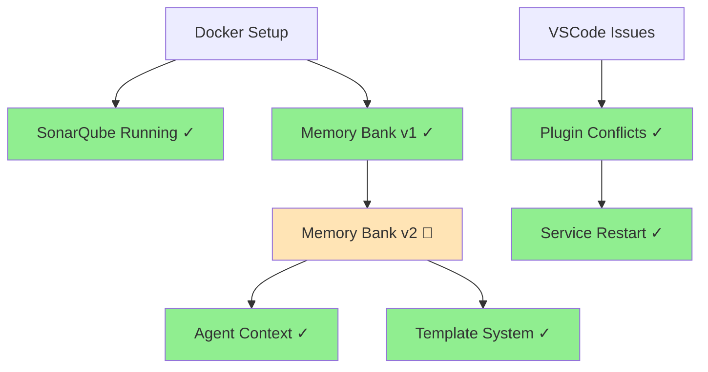

# Progress: SonarQube Open Server Development

## Summary

Working on SonarQube Open Server setup with v2 memory bank implementation. Previous session implemented memory bank templates and worked on diagram rendering. Current session focused on agent context tracking and continuity.

## Completed Tasks

- [x] Initialize Docker Compose SonarQube setup - 2025-09-18
- [x] Create memory bank v2 template system - 2025-09-18
- [x] Resolve VSCode extension conflicts with diagram rendering - 2025-09-18
- [x] Remove problematic plugins and restart SonarQube services - 2025-09-18
- [x] Create agent active context system with UUID tracking - 2025-09-18
- [x] Review v2 memory bank implementation structure - 2025-09-18
- [x] Update memory bank with current session context - 2025-09-21
- [x] Implement agent UUID continuity system - 2025-09-21
- [x] Test diagram rendering in memory bank files - 2025-09-21
- [x] Complete SonarQube project analysis examples - 2025-09-21
- [x] Document troubleshooting patterns - 2025-09-21
- [x] Document agent handoff procedures - 2025-09-21

## In Progress

- Complete memory bank updates with recent operational changes (2025-09-25)
- Create fresh backups of SonarQube and PostgreSQL volumes before further changes

## Upcoming Tasks

- Review Docker image tags for exact LTA (2025.1) and optionally pin to exact tag
- Remove deprecated `version` key from `docker-compose.yml` to silence compose warning

## Milestones

### Phase 1: Core Setup - 2025-09-18

- Docker Compose environment working
- SonarQube accessible at localhost:9000
- Status: Completed

### Phase 2: Memory Bank v2 - 2025-09-18

- Template system implemented
- Agent context tracking added
- Status: In Progress

## Progress Visualization

## Metrics

- **Progress**: 75% complete on Phase 2
- **Timeline**: On track
- **Quality**: No major issues
- **Performance**: SonarQube services running smoothly

## Challenges Encountered

- VSCode extension conflicts: Diagram rendering caused conflicts, resolved by plugin removal and reload
- Agent context continuity: Addressed by implementing UUID-based agent tracking system
- Memory persistence: Solved by creating structured memory bank entries

## Learnings

- Memory bank needs agent context tracking for session continuity
- VSCode diagram extensions can conflict with each other
- Docker service restart resolves most plugin-related issues

## Next Steps

1. Complete current session memory bank updates
2. Test diagram rendering stability
3. Document agent handoff procedures
