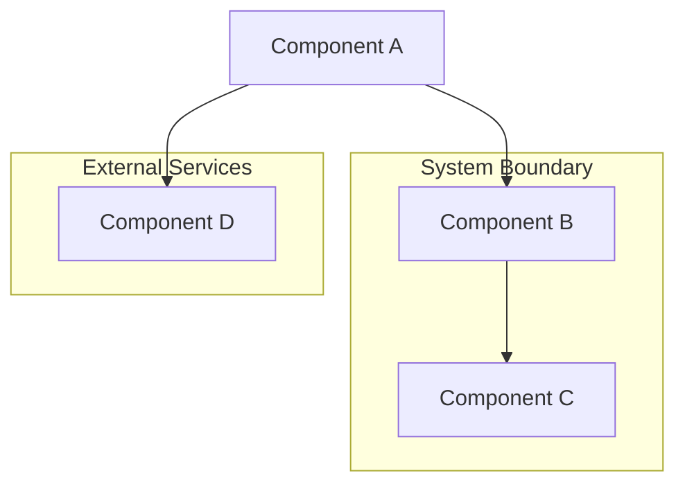

# Architecture: [Title]

## Overview
High-level description of the architectural component, pattern, or system.

## Architecture Diagram

## Components
### Component 1
- **Purpose**: What this component does
- **Responsibilities**: Key responsibilities
- **Dependencies**: What it depends on
- **Interfaces**: How it communicates

### Component 2
- **Purpose**: What this component does
- **Responsibilities**: Key responsibilities
- **Dependencies**: What it depends on
- **Interfaces**: How it communicates

## Data Flow
Description of how data flows through the system.

## Key Patterns
- **Pattern 1**: Description and rationale
- **Pattern 2**: Description and rationale
- **Pattern 3**: Description and rationale

## Quality Attributes
- **Performance**: Performance characteristics and requirements
- **Scalability**: How the system scales
- **Security**: Security considerations
- **Maintainability**: How easy it is to maintain
- **Reliability**: Reliability characteristics

## Constraints
- Technical constraints
- Business constraints
- Resource constraints

## Trade-offs
- What was gained vs. what was sacrificed
- Alternative approaches considered
- Why this approach was chosen

## Future Considerations
- Known limitations
- Planned improvements
- Evolution path