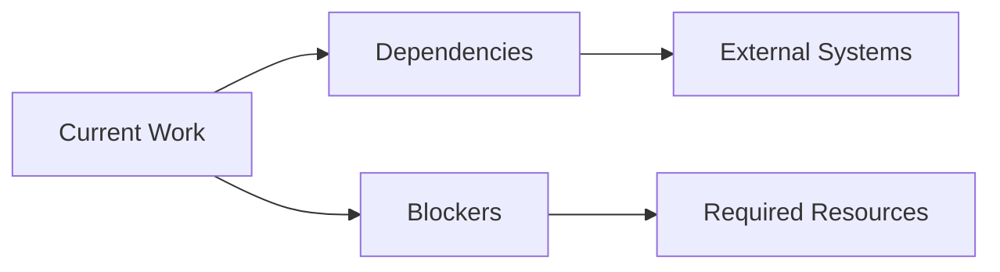

# Context: [Title]

## Current State
Brief description of the current state of the project/feature/issue.

## Active Work
- What is currently being worked on
- Current priorities
- Active decisions being made

## Immediate Goals
- Short-term objectives
- Next steps
- Immediate decisions needed

## Blockers & Dependencies
- Current blockers
- External dependencies
- Required resources

## Key Information
- Critical details that affect current work
- Important constraints or requirements
- Relevant deadlines or milestones

## Context Diagram

## Related Memories
- Links to related decision logs
- References to architectural choices
- Related progress tracking