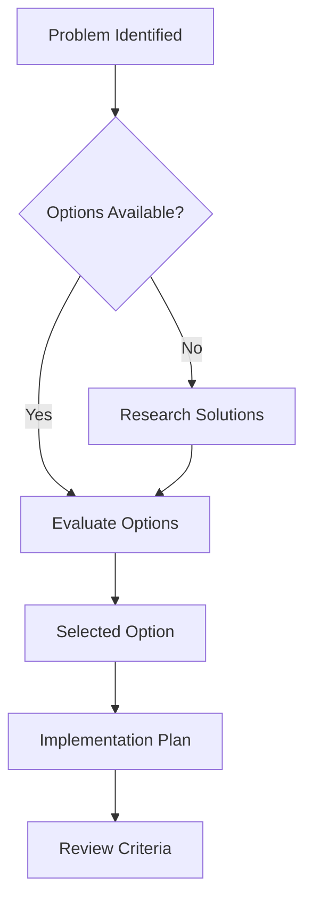

# Decision: [Title]

## Status
**Decision Status**: [Proposed/Accepted/Rejected/Superseded]

## Context
Brief description of the situation that led to this decision.

## Decision
Clear statement of what was decided.

## Rationale
- Why this decision was made
- Key factors that influenced the choice
- Trade-offs considered

## Decision Flow

## Alternatives Considered
- Option 1: Description and why it was rejected
- Option 2: Description and why it was rejected
- Option 3: Description and why it was rejected

## Consequences
- Positive outcomes expected
- Negative consequences accepted
- Risks and mitigation strategies

## Implementation
- How this decision will be implemented
- Timeline and milestones
- Responsible parties

## Review Criteria
- When this decision should be reviewed
- What would trigger a reconsideration
- Success metrics