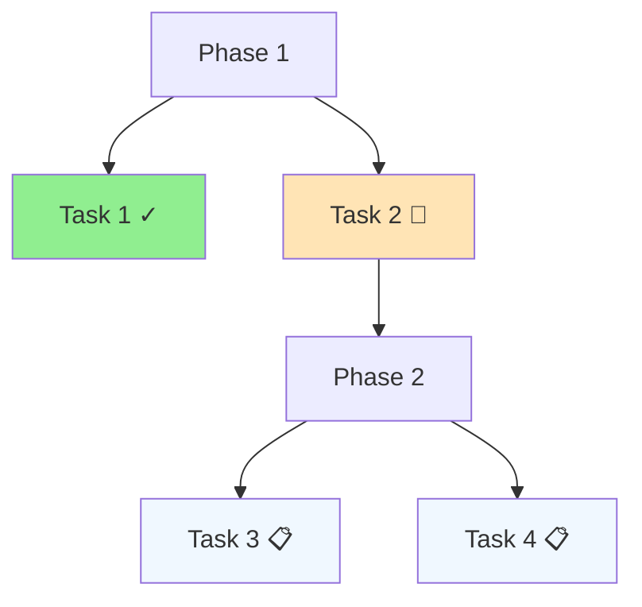

# Progress: [Title]

## Summary
Brief summary of the work completed and current status.

## Completed Tasks
- [x] Task 1: Description and completion date
- [x] Task 2: Description and completion date
- [x] Task 3: Description and completion date

## In Progress
- [ ] Task 4: Description and current status
- [ ] Task 5: Description and current status

## Upcoming Tasks
- [ ] Task 6: Description and planned start
- [ ] Task 7: Description and planned start
- [ ] Task 8: Description and planned start

## Milestones
### Milestone 1 - [Date]
- Description of milestone
- Key deliverables
- Status: [Completed/In Progress/Planned]

### Milestone 2 - [Date]
- Description of milestone
- Key deliverables
- Status: [Completed/In Progress/Planned]

## Progress Visualization

## Metrics
- **Progress**: X% complete
- **Timeline**: On track/Behind/Ahead
- **Quality**: Number of issues/bugs
- **Performance**: Key performance indicators

## Challenges Encountered
- Challenge 1: Description and resolution
- Challenge 2: Description and current status
- Challenge 3: Description and mitigation plan

## Learnings
- Key insights gained
- Best practices discovered
- Things to do differently next time

## Next Steps
1. Immediate next action
2. Short-term goals (1-2 weeks)
3. Medium-term goals (1-2 months)