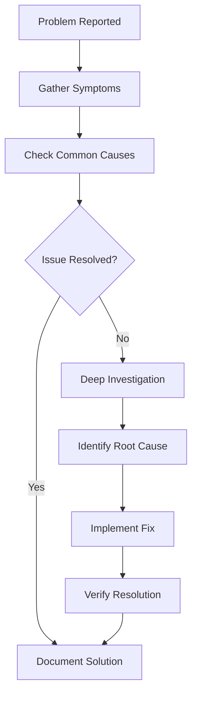

# Troubleshoot: [Title]

## Problem Description
Clear description of the issue encountered.

## Symptoms
- Observable behavior 1
- Observable behavior 2
- Error messages or logs

## Environment
- System information
- Software versions
- Configuration details
- When the problem occurs

## Root Cause
Identified or suspected root cause of the issue.

## Troubleshooting Flow

## Investigation Steps
1. Step 1: What was checked and result
2. Step 2: What was checked and result
3. Step 3: What was checked and result

## Solutions Attempted
### Solution 1: [Description]
- **Steps**: What was done
- **Result**: What happened
- **Status**: [Successful/Failed/Partial]

### Solution 2: [Description]
- **Steps**: What was done
- **Result**: What happened
- **Status**: [Successful/Failed/Partial]

## Final Solution
Detailed description of the solution that worked.

### Steps to Implement
1. Step 1: Detailed instructions
2. Step 2: Detailed instructions
3. Step 3: Detailed instructions

### Verification
How to verify the solution worked:
- Check 1
- Check 2
- Test 3

## Prevention
How to prevent this issue in the future:
- Preventive measure 1
- Preventive measure 2
- Monitoring recommendation

## Related Issues
- Link to similar problems
- Related troubleshooting guides
- Known limitations or workarounds

## Resources
- Documentation links
- Forum discussions
- Bug reports or tickets